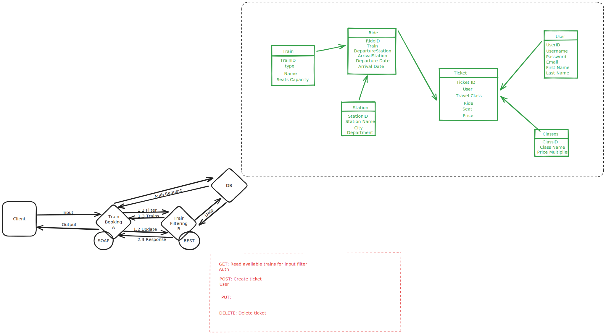

# SIA-Midterm

## Objective

Create a train journeys and booking service which has basic functions:

- ### Train Searching: 
    customers can search available trains based on departure and arrival stations, the outbound and return dates and time, number of tickets and travel class (First, Business or Standard).

- ### Train booking: 
    customers can reserve a seat by providing the trains IDs, the travel class (First, Business or Standard)and ticket type (flexible, not flexible).

## [Scenario](https://www-inf.telecom-sudparis.eu/SIMBAD/courses/doku.php?id=teaching_assistant:web_services:midterm2021_88)




## Java version
This project is written in Java 8. You can download and install it from the official website: [Java SE Downloads](https://www.oracle.com/fr/java/technologies/javase/javase8-archive-downloads.html)

## Train Filtering

Running on port 8182
Example:
```
http://localhost:8182/trains/stop_area%3ASNCF%3A87182113/stop_area%3ASNCF%3A80359331/2024-01-15/2024-01-16/1/Second%20Class
```

## Train Booking 

Running on port 8088

## Client

Running on port 8081

## SNCF API 

### Departures 
```
https://api.sncf.com/v1/coverage/sncf/stop_areas/stop_area:SNCF:87686006/departures
```

## Swagger API Documentation

Explore and test our APIs using Swagger: [Swagger API Documentation](https://app.swaggerhub.com/apis-docs/ChristopheWANG/WebServiceTrainAPI/1.0.0)

or go to http://localhost:8082/
and explore 
```
./openapi.yaml
``` 

## Docker and Migration

To run the project using Docker and perform data migrations, use the following commands:

1. Build and run the Docker container:
    ```bash
    make run_docker
    ```

2. Run data migration:
    ```bash
    make run_migration-data
    ```

## Postman

Join our Postman team to explore and test the APIs: [Postman Team Invitation](https://app.getpostman.com/join-team?invite_code=b48fc3c44dd89efbf1fa6906f2360eb9&target_code=026a0c4e0b4d720e6d31e0234dc07284)

Find the Postman collection file for API testing in the `/Postman` directory:

- [BookingWS.postman_collection.json](./Postman/BookingWS.postman_collection.json)


## Notation 

| # | Requirements                                   | Marks (30) | our Notation |
|---|-----------------------------------------------|------------|--------------------|
| 1 | Create REST Train Filtering service            | 6          |          6         |
| 2 | Create SOAP Train Booking service              | 4          |           4        |
| 3 | Interaction between two services              | 4          |           4        |
| 4 | Test with Web service Client                  | 2          |          2         |
| 5 | Work with complex data type (class, table, etc.) | 2       |           2        |
| 6 | Work with database (in text file, xml, in mysql, etc.) | 2  |           2        |
| 7 | Postman                                       | 2          |             2      |
| 8 | OpenAPI                                       | 3          |              3     |
| 9 | BPMS                                          | 5          |            2       |
